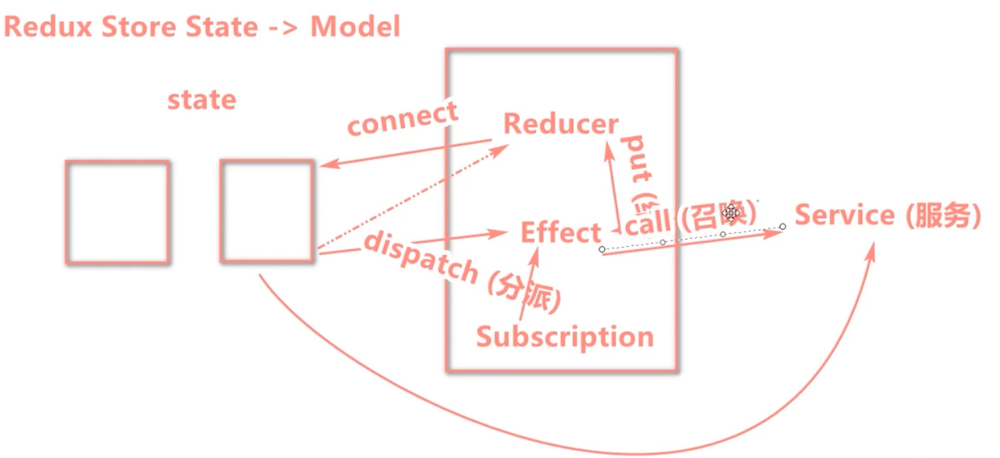

# Dva,Uml 概述

## Dva

平时我们操作 React 必须会用到 Redux,以及它的扩充插件比如 sage,thunk,等等。

这些插件组合实在太繁琐了。所以 Dva 破茧而出。它里面包含了 Redux,以及对 Redux 一系列的操作。方便快捷，开箱即用。一共仅仅 6 个 api。其中还包含了路由配置

## Dva 的流程

在 Dva 里面公共数据叫做 Model,私有数据叫做 state

### 第一步分成两块

分别是页面和仓库

### 页面(state)的作用

- 它的主要作用就是派送货物(我这里把数据理解为货物) 英文就是 dispatch

- 这里的货物有的是自营(同步)有的是加盟(异步 service)

### 仓库(Model)的作用

仓库分成 3 大类

- Reducer

- Effect

- Subscription

### Reducer 加工厂

- reducer 无论是什么货物,它是给页面返回数据的唯一出口。它和页面链接用 connect

- Effect 是在加工厂内封装货物,这里的货物有的是自营(同步)有的是加盟(异步 service),
  异步就必须利用 call 命令等待 service 完成,获取到货物后,在利用 put 派发给 Reducer

- Subscription 也是向工厂派发货物。只不过这个操作和页面无关了。比如(监听路由变化,按钮按下触发之类的) 为了好记，你可以理解为自动发货。他用到的命令(dispatch)

> 总结如上。具体可以看下图

## Dva 文件目录结构

> 一般情况我们分成 4 个文件

- index.tsx (页面)

- Model (仓库)

- Service (异步数据)

- compoents/sonindex.tsx(index.tsx 下面的组件)
