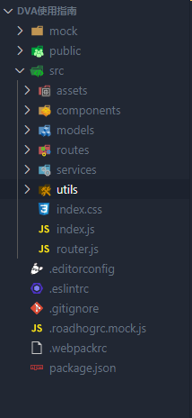

# Dva 使用指南

Dva 这个轻应用框架是集成了 React-saga React-Redux,还有路由等，方便使用.

## 安装

### 安装 dva-cli 脚手架

- 最好先安装 Git

- 通过 npm 安装 dva-cli

```javascript
cnpm i dva-cli -g
dva -v
```

### 创建新应用

- 命令

```javascript
dva new xxxx(名称)
```

- 然后到项目名称那个目录下执行

```javascript
npm start
```

- 几秒后会看到回复

```javascript

Compiled successfully!

The app is running at:

  http://localhost:8000/

Note that the development build is not optimized.
To create a production build, use npm run build.

```

- 创建好应用以后 项目目录如图



- assets 静态文件

- components 页面里面的组件

- models (最重要)写 Redux 模块

- routes 文件夹就是页面存放

- services 异步获取数据文件夹

- utils 工具类

## 定义路由

### 加载路由

- 在 routes 文件夹下面创建新的页面

- 然后在 router.js 文件下写路由

```javascript
import React from 'react';
import { Router, Route, Switch } from 'dva/router';
import IndexPage from './routes/IndexPage';
import ProductPage from './routes/Products';
function RouterConfig({ history }) {
  return (
    <Router history={history}>
      <Switch>
        <Route path="/" exact component={IndexPage} />
        <Route path="/about" exact component={ProductPage}></Route>
      </Switch>
    </Router>
  );
}

export default RouterConfig;
```

### 路由跳转和路由参数

- 路由参数必须要引用到 withrouter

- 跳转必须是 history.push (pathname 和 state)

- 接收数据的时候判断 props.history.location.state

```javascript
import React from 'react';
import { connect } from 'dva';
import styles from './IndexPage.css';
import { withRouter } from 'dva/router';
function IndexPage(props) {
  function getRouterid() {
    console.log(props);
    if (props.history.location.state) {
      return <div>{props.history.location.state.id}</div>;
    } else {
      return null;
    }
  }
  function gotourl() {
    props.history.push({
      pathname: '/about',
      state: {
        id: '从Home页面传递过来的值是哈哈哈',
      },
    });
  }
  return (
    <div className={styles.normal}>
      <h1 className={styles.title}>Yay! Welcome to dva!</h1>
      <div className={styles.welcome} />
      <ul className={styles.list}>
        <li>
          To get started, edit <code>src/index.js</code> and save to reload.
        </li>
        <li>
          <a href="https://github.com/dvajs/dva-docs/blob/master/v1/en-us/getting-started.md">
            Getting Started
          </a>
        </li>
      </ul>
      {getRouterid()}
      <button onClick={gotourl}>点击跳转</button>
    </div>
  );
}

IndexPage.propTypes = {};

export default connect()(withRouter(IndexPage));
```

## 使用(5 大部分)(Model 层)

- 它暴露的就是个对象(最外层)

- 里面有 5 大部分(namespace,state,reducers,effects,subscriptions)

### namespace

命名空间:在页面里面要是想 dispatch type 必须指定命名空间

```javascript
const mapMutations = (dispatch) => {
  return {
    handlegetList() {
      dispatch({
        type: 'product/getvalue',
      });
    },
    handlegetResultId() {
      dispatch({
        type: 'product/getId',
      });
    },
  };
};
```

### state 公共数据

### reducers 通向页面的唯一出口

- 它里面有很多函数,每一个函数必须有返回值

- 返回值必须和 state 里面的数据一致

- 不能在原数据操作,必须重新定义

- {payload} 就是 action 的扩展

```javascript
  reducers: {
    changevalue: (state, { payload }) => {
      const Result = JSON.parse(JSON.stringify(state));
      Result.value = payload;
      return Result;
    },
    getList: (state, { payload }) => {
      const Result = JSON.parse(JSON.stringify(state));
      Result.list = payload;
      return Result;
    },
    getResultId: (state, { payload }) => {
      const Result = JSON.parse(JSON.stringify(state));
      Result.resultdata = payload;
      return Result;
    },
  },
```

### effects 异步数据发送

- effects 里面都是函数

- effects 发送必须是星号函数，里面每一步必须都是 yield,获取数据的异步函数

- 因为是异步函数所以必须是 call 来获取数据，然后再用 put 发送到 reducers 里面

- 要是 call 想传值必须在第二个参数里面写

```javascript
//获取数据
import { getList, getRecordId } from "../services/proservers";
//然后efffects
effects: {
    *getId({ payload }, { put, call }) {
      const data = yield call(getRecordId, 5);
      yield put({
        type: "getResultId",
        payload: data,
      });
    },
    *getvalue({ payload }, { put, call }) {
      const data = yield call(getList);
      yield put({
        type: "getList",
        payload: data,
      });
    },
  },
```

- 刚才引用了 services 文件夹下面的文件，services 就是负责调取接口

```javascript
import axios from 'axios';

const getList = () => {
  return axios.get('http://localhost:3000/result').then((res) => {
    console.log(res);
    return res.data;
  });
};

const getRecordId = (id) => {
  console.log(id);
  return axios.get(`http://localhost:3000/result/${id}`).then((res) => {
    console.log(res);
    return res.data;
  });
};

export { getList, getRecordId };
```

### subscriptions 监听

- 这个监听和用户没关系。它是满足一定条件后自动触发,因为是触发所以是 dispatch

```javascript
  subscriptions: {
    setup({ history, dispatch }) {
      return history.listen((location, action) => {
        console.log(location.pathname);
        console.log(location.state);
        console.log(action);
         //history.push()
        if (location.pathname === "/about") {
          dispatch({
            type: "changevalue",
            payload: "测试的公共数据",
          });
        }
      });
    },
  },
```

### models 完整版

```javascript
import { getList, getRecordId } from '../services/proservers';
const ProductModel = {
  namespace: 'product',
  state: {
    value: '',
    list: [],
    resultdata: '',
  },
  reducers: {
    changevalue: (state, { payload }) => {
      const Result = JSON.parse(JSON.stringify(state));
      Result.value = payload;
      return Result;
    },
    getList: (state, { payload }) => {
      const Result = JSON.parse(JSON.stringify(state));
      Result.list = payload;
      return Result;
    },
    getResultId: (state, { payload }) => {
      const Result = JSON.parse(JSON.stringify(state));
      Result.resultdata = payload;
      return Result;
    },
  },
  effects: {
    *getId({ payload }, { put, call }) {
      const data = yield call(getRecordId, 5);
      yield put({
        type: 'getResultId',
        payload: data,
      });
    },
    *getvalue({ payload }, { put, call }) {
      const data = yield call(getList);
      yield put({
        type: 'getList',
        payload: data,
      });
    },
  },
  subscriptions: {
    setup({ history, dispatch }) {
      return history.listen((location, action) => {
        console.log(location.pathname);
        console.log(location.state);
        console.log(action);
        //history.push()
        if (location.pathname === '/about') {
          dispatch({
            type: 'changevalue',
            payload: '测试的公共数据',
          });
        }
      });
    },
  },
};

export default ProductModel;
```

### 组件里面使用的时候

- 必须在 index.js 里面加载模块

```javascript
import dva from 'dva';
import './index.css';

// 1. Initialize
const app = dva();

// 2. Plugins
// app.use({});

// 3. Model
// app.model(require('./models/example').default);
app.model(require('./models/Product').default);
// 4. Router
app.router(require('./router').default);

// 5. Start
app.start('#root');
```

- 组件里面使用 connect 链接,注意 type 指定命名空间

```javascript
import { connect } from 'dva';
```

- 完整版

```javascript
import React, { useState, useEffect } from 'react';
import List from '../components/Product/ProductList.js';
import { connect } from 'dva';
import { withRouter } from 'dva/router';
const ProductExample = (props) => {
  useState(() => {
    props.handlegetList();
    props.handlegetResultId();
  }, []);
  function gotourl() {
    console.log(props);
    props.history.push({
      pathname: '/',
      state: {
        id: 3,
      },
    });
  }
  function getId() {
    if (props.history.location.state) {
      return <div>{props.history.location.state.id}</div>;
    } else {
      return null;
    }
  }
  if (props.list.length > 0) {
    console.log(props.list);
    return (
      <div>
        <p>这就是测试页面</p>
        <List data={props.value}></List>
        <ul>
          {props.list.map((content, index) => {
            return (
              <li key={index}>
                {content.id}---{content.value}
              </li>
            );
          })}
        </ul>
        <div>
          {props.resultdata.id}---{props.resultdata.value}
        </div>
        <button onClick={gotourl}>点击跳转</button>
        {getId()}
      </div>
    );
  } else {
    return null;
  }
};

const mapState = (state) => {
  return {
    value: state.product.value,
    list: state.product.list,
    resultdata: state.product.resultdata,
  };
};

const mapMutations = (dispatch) => {
  return {
    handlegetList() {
      dispatch({
        type: 'product/getvalue',
      });
    },
    handlegetResultId() {
      dispatch({
        type: 'product/getId',
      });
    },
  };
};

export default connect(mapState, mapMutations)(withRouter(ProductExample));
```
